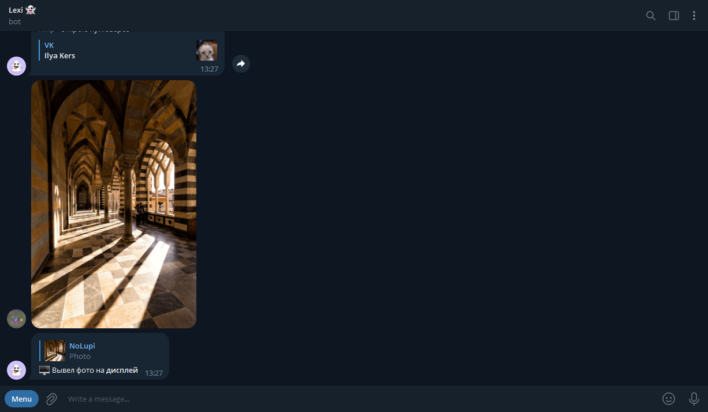

<p align="center">
  <h1 align="center">Lexsi</h1>

  <p align="center">
    Awesome Telegram bot for managing your Windows PC
    <br/>
    <br/>
    <a href="https://github.com/NoLupiPls/Lexsi"><strong>Explore the docs »</strong></a>
    <br/>
    <br/>
    <a href="https://github.com/NoLupiPls/Lexsi">View Demo</a>
    .
    <a href="https://github.com/NoLupiPls/Lexsi/issues">Report Bug</a>
    .
    <a href="https://github.com/NoLupiPls/Lexsi/issues">Request Feature</a>
  </p>
</p>

     

## Table Of Contents

* [About the Project](#about-the-project)
* [Built With](#built-with)
* [Getting Started](#getting-started)
  * [Installation](#installation)
* [Usage](#usage)
* [Contributing](#contributing)
* [License](#license)
* [Authors](#authors)
* [Acknowledgements](#acknowledgements)

## About The Project



There are many repositories available on GitHub, but I didn't find a single bot in Telegram for personal computer management on Windows OS. That's why I created one.

Of course, no bot will serve all your needs, as your needs may be different. So I will add more in the near future. You can also suggest changes by branching this repository and creating a pull request or opening a problem.

A list of commonly used resources that I find helpful are listed in the acknowledgements.

## Built With

* Aiogram
* PyAytoGUI
* Python-dotenv

## Getting Started

This is an example of how you may give instructions on setting up your project locally.
To get a local copy up and running follow these simple example steps.

### Installation

1. Clone the repo

```sh
git clone https://github.com/NoLupiPls/Lexsi.git
```

3. Install requirements

```sh
pip install -r requirements.txt
```

4. Replace the env settings and rename to .env

5. Start the project

```sh
python app.py
```

## Usage

* <b>/open</b> <i>vk</i> - open the link .com
* <b>/open</b> r <i>kinopoisk</i> - link .ru
* <b>/st</b> - I'll collapse and load
* <b>/sleep</b> - I'll switch to sleep mode
* <b>/volume</b> - from the volume menu
* <b>/music</b> - I'll open Yandex.Music
* <b>/kino</b> - I'll open kinopoisk
* <b>/tg</b> - open Telegram
* <b>/ru</b> - minimize windows
* <b>/pause</b> - pause video or music
* <b>/close</b> - close window
* <b>/site</b> <i>https://vk.com/nolupi </i> - insert the link
* <b>/imp</b> on the right - I will open Genshin Impact

## Contributing

Contributions are what make the open source community such an amazing place to be learn, inspire, and create. Any contributions you make are **greatly appreciated**.
* If you have suggestions for adding or removing projects, feel free to [open an issue](https://github.com/NoLupiPls/Lexsi/issues/new) to discuss it, or directly create a pull request after you edit the *README.md* file with necessary changes.
* Please make sure you check your spelling and grammar.
* Create individual PR for each suggestion.
* Please also read through the [Code Of Conduct](https://github.com/NoLupiPls/Lexsi/blob/main/CODE_OF_CONDUCT.md) before posting your first idea as well.

### Creating A Pull Request

1. Fork the Project
2. Create your Feature Branch (`git checkout -b feature/AmazingFeature`)
3. Commit your Changes (`git commit -m 'Add some AmazingFeature'`)
4. Push to the Branch (`git push origin feature/AmazingFeature`)
5. Open a Pull Request

## License

Distributed under the MIT License. See [LICENSE](https://github.com/NoLupiPls/Lexsi/blob/main/LICENSE.md) for more information.

## Authors

* **NoLupiPls - <i>Ilya</i>** - *School student* - [NoLupiPls - Ilya](https://github.com/NoLupiPls/) - *Built this project*

## Acknowledgements

* [NoLupiPls - <i>Ilya</i>](https://github.com/NoLupiPls/)
